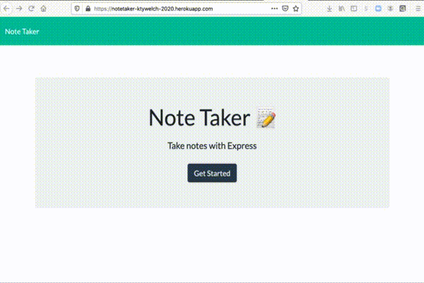

# NoteTaker

The NoteTaker application allows a user to read, write, change and save notes. This application uses  express.js back end, saves and retrieves the note data from a JSON file.

The application has been deployed to Heroku.

[NoteTaker Application on Heroku](https://notetaker-ktywelch-2020.herokuapp.com/)

[NoteTaker application can be found on github repository ](https://github.com/ktywelch/NoteTaker)

## Table of contents
* [Installation](#Installation)
* [Usage](#Usage)
* [Technologies](#Technologies)
* [Contributions](#Contributions)
* [License](#License)
## Installation
The installation pocess is a download of git source, using npm install to install required modules based on the package.json file included in the same directory as the application.

* Download the Application from github (see link above)
* change to the Developer Directory 
* run "npm install" to install the required modules
* to start the server on a local system run one of the following from the Develop directory:
    * if nodemon is available "nodemon server.js"
    * if nodemon is not availaable "node server.js"

## Useage
Users will be able to Add, Delete and Change exisiting notes. 

* If intalled locally start use the link:
    * [localhost:800](http://localhost:8000)
    * [https://notetaker-ktywelch-2020.herokuapp.com/](https://notetaker-ktywelch-2020.herokuapp.com/)
* Click on the "GetStarted" button
* The existing notes will be seen on the column on the left side
* To open the note click on the cell containing the note
* Click on the upper right hand pencil to edit or add a note
* To save the note click on the upper left icon that resembles an older disk to save - this icon will only appear if a note has been updated or if the new note contains both title and text.

* Afer a note has been saved (applies to changed and new) the note will be added to the end of list of notes on the left column
* Post save on the left column the user will have a new Note screen
* To delete a note click on the trash can icon with the note

## Technologies
The application was created using several opensource technologies used in developing javascript code.

* VSCode
* node.js
* npm and modules express,fs,nanoid
* bootstrap for styling

## Contributions
Recognizing contributors and sites that helped in development:

* Lauren Hutchinson 
* Sam Ayler 
* Vincent Gines 
* Lucah Endicott

## License
MIT

Permission is hereby granted, free of charge, to any person obtaining a copy
of this software and associated documentation files (the "Software"), to deal
in the Software without restriction, including without limitation the rights
to use, copy, modify, merge, publish, distribute, sublicense, and/or sell
copies of the Software, and to permit persons to whom the Software is
furnished to do so, subject to the following conditions:

The above copyright notice and this permission notice shall be included in all
copies or substantial portions of the Software.

THE SOFTWARE IS PROVIDED "AS IS", WITHOUT WARRANTY OF ANY KIND, EXPRESS OR
IMPLIED, INCLUDING BUT NOT LIMITED TO THE WARRANTIES OF MERCHANTABILITY,
FITNESS FOR A PARTICULAR PURPOSE AND NONINFRINGEMENT. IN NO EVENT SHALL THE
AUTHORS OR COPYRIGHT HOLDERS BE LIABLE FOR ANY CLAIM, DAMAGES OR OTHER
LIABILITY, WHETHER IN AN ACTION OF CONTRACT, TORT OR OTHERWISE, ARISING FROM,
OUT OF OR IN CONNECTION WITH THE SOFTWARE OR THE USE OR OTHER DEALINGS IN THE
SOFTWARE.